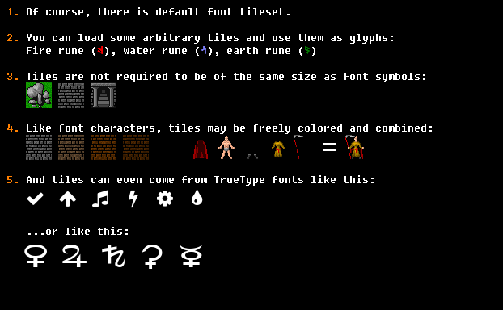
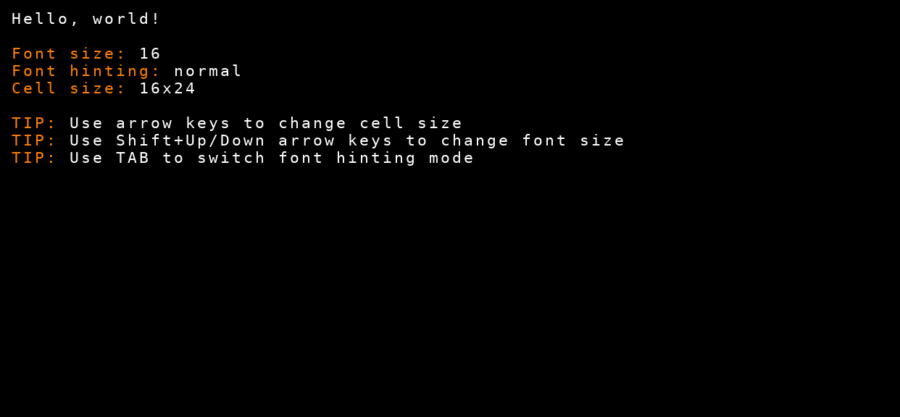

# bearlibterminal-hs -

Also available on [Hackage](https://hackage.haskell.org/package/bearlibterminal).

Low-level Haskell bindings to the [BearLibTerminal](http://foo.wyrd.name/en:bearlibterminal) graphics library, primarily for roguelike games.

## Description

The design overview of the original library is excellent to get an understanding of how things work: http://foo.wyrd.name/en:bearlibterminal:design.

## Getting Started

### Installing

* This library assumes you have built the main `BearLibTerminal` library (or downloaded the precompiled binaries available from http://foo.wyrd.name/en:bearlibterminal) and your build tool can find it (e.g. by setting `LD_LIBRARY_PATH` or `DYLD_LIBRARY_PATH`).
* Add `bearlibterminal` to your `*.cabal` `build-depends`.
* Enjoy.

## How can I do things?

This is pretty much a 1-to-1 mapping of the original BLT API, with some marshalling of types and wrappers around function calls that take C strings (these are offered in `CString`, `Text`, and `String` flavours).

Every API call is available as both a raw FFI call (`c_terminal_snake_case`) and as a monadic `MonadIO m => ... m a` function.

Other notes:
- Colours are still simply 4-byte `Int`s. Higher level colour functions are available in `roguefunctor`.
- `terminalComposition` takes a `TerminalCompositionMode` rather than raw integers.
- Events read by `terminal_peek`, `terminal_read` are returned as raw integers (`terminalPeekCode`) and as `Keycode`s (`terminalPeek`).

## This is a bit too low level for me...

Check out the Haskell roguelike toolkit library [roguefunctor](https://github.com/ppkfs/roguefunctor), which is the high-level, opinionated wrapper around this library with nicer abstractions for positions, colours, config options, event handling, rendering, and so forth.

# Screenshots from the Omni demo

